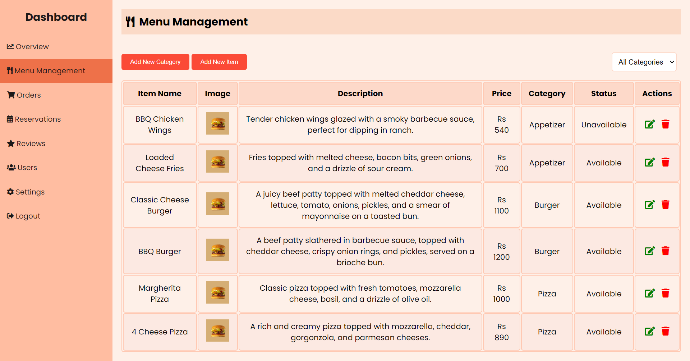
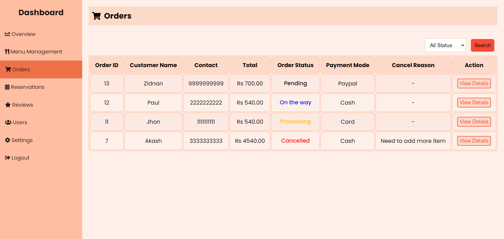
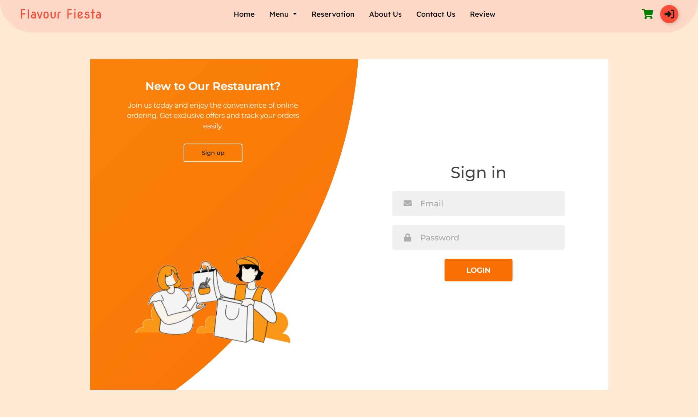
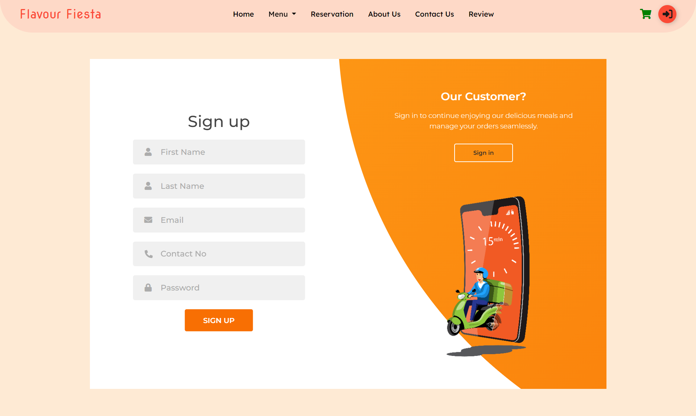

# Online Food Order System for Restaurant

An efficient and user-friendly online food ordering system designed to enhance the dining experience for customers and streamline operations for restaurant admins.

## Table of Contents

- [About](#about)
- [Features](#features)
- [Technology Stack](#technology-stack)
- [Screenshots](#screenshots)

## About

This project provides a comprehensive solution for restaurants to manage their menu, handle orders, and receive customer feedback. It includes a robust admin panel for managing operations and a seamless user interface for customers.

## Features

### Customer Features

- **User Registration and Login**: Secure account creation and access.
- **Browse Menu Items**: View detailed descriptions and prices of menu items.
- **Add Items to Cart**: Easily add and modify items in the shopping cart.
- **Place Orders**: Complete your order with multiple payment options.
- **Order Tracking**: 
  - **Track Order Status**: View real-time updates on the status of your orders, including whether it’s pending, in preparation, out for delivery, or completed.
  - **Order Details**: Access detailed information about your orders, including item names, quantities, and delivery address.
  - **Order History**: Review past orders, view details, and track the status of previous orders.
- **Leave Feedback and Reviews**: Share your dining experience with reviews and ratings.
- **Table Reservation**: Reserve a table for your visit by selecting a date, time, and number of guests.
- **Profile Settings**: Update personal information such as email, password, and contact details.

### Admin Features

- **Manage Menu Items and Categories**: Add, update, and remove menu items and categories.
- **View and Manage Customer Orders**: Access and process customer orders efficiently.
- **Handle Table Reservations**: View and manage table reservations made by customers.
- **View Customer Feedback**: Monitor and respond to customer reviews.
- **Manage User Accounts**: Administer user accounts and permissions.

## Technology Stack

- **Frontend**: HTML, CSS, JavaScript
- **Backend**: PHP
- **Database**: MySQL
- **Others**: Bootstrap for UI components, jQuery for DOM manipulation

## Screenshots

These images are included to better illustrate the functionality and user interface of the Online Food Order System and it showcase different parts of the application, including the customer interface, admin panel, and key features.

### Admin Interface Screenshots

1. **Menu Management**  
     
   Description: The interface for adding, updating, and removing menu items and categories.
   
2. **Order Summary Page**  
     
   Description: The page displaying a summarized table of all orders for quick overview.

### User Interface Screenshots

1. **User Login Page**  
     
   Description: The login page where users can securely log into their accounts.

. **User Registration Page**  
     
   Description: The registration page where new users can create an account.
 

   
